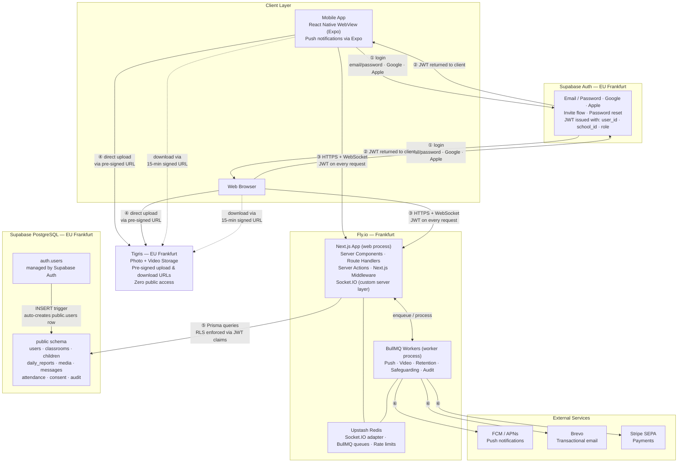

# Architecture Diagram
**Last Updated**: 2026-04-17

## Flow Reference

| # | Description |
|---|---|
| ① | Client authenticates directly with Supabase Auth — the Next.js app never sees the password |
| ② | Supabase Auth returns a JWT with `school_id` and `role` injected via a custom PostgreSQL hook |
| ③ | All requests (page loads, Server Actions, Socket.IO) go to the Next.js app on Fly.io with the JWT; Next.js Middleware sets the RLS session variable before any DB query |
| ④ | Media uploads go directly from the client to Tigris via a pre-signed URL — Next.js never proxies the file |
| ⑤ | Server Components and Server Actions query Supabase via Prisma; RLS policies read `school_id` + `role` from the session config, blocking cross-tenant access at DB level |
| ⑥ | BullMQ workers (separate Fly.io process) dispatch push notifications (FCM), emails (Brevo), and payment events (Stripe) |

## Key Differences from Previous Architecture

| Before | After |
|--------|-------|
| Separate Fastify API server | Unified Next.js app (Server Components + Route Handlers + Server Actions) |
| React Native full native app with WatermelonDB | React Native WebView wrapper — no native data layer |
| Offline sync via native SQLite + pull/push protocol | Offline via PWA service worker + IndexedDB (Dexie.js) |
| Mobile and web as separate API consumers | Mobile loads the web app in a WebView — single product surface |
