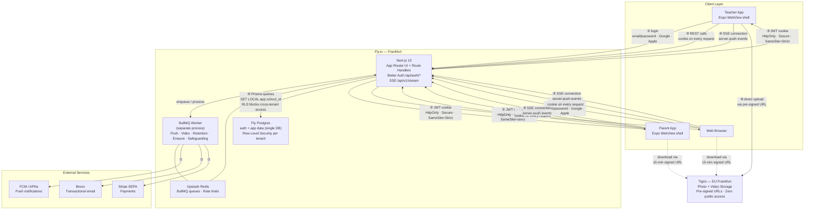

# Architecture Diagram
**Last Updated**: 2026-04-25

## Flow Reference

| # | Description |
|---|---|
| ① | Client authenticates via Better Auth, mounted as a Next.js Route Handler at `/api/auth/*` — email/password, Google, or Apple OAuth |
| ② | Better Auth sets a signed JWT in an HttpOnly cookie; the WebView cookie jar handles it automatically — no token storage code needed in the Expo shell |
| ③ | All REST API calls go to Next.js Route Handlers (`/api/v1/*`) with the JWT cookie on every request; `requireAuth()` validates the session and sets the RLS tenant context |
| ④ | While the user has the app open, a persistent SSE connection (`/api/v1/stream`) delivers server-push events: `message.new`, `report.published`, `media.ready` |
| ⑤ | Next.js queries Fly Postgres via Prisma; `requireAuth()` runs `SET LOCAL app.school_id = <uuid>` before every request, and RLS policies block any cross-tenant row access at the DB level |
| ⑥ | Media uploads go directly from the client to Tigris via a short-lived pre-signed URL — Next.js never proxies the file bytes |
| ⑦ | BullMQ workers (running as a separate process on the same Fly machine) dispatch push notifications (FCM), transactional emails (Brevo), and payment events (Stripe) |
