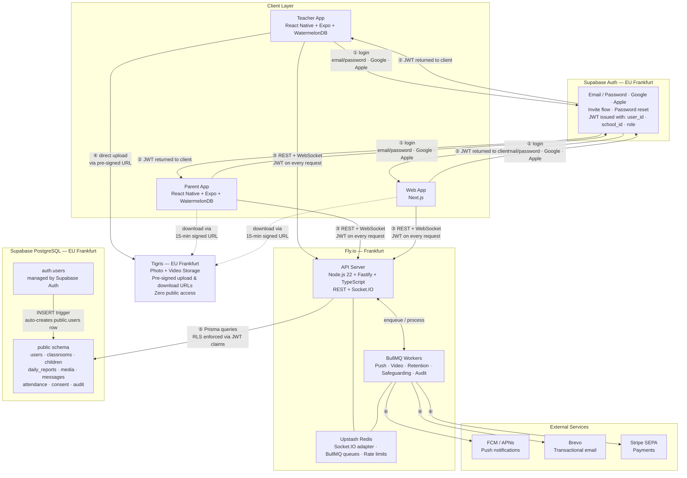

# Architecture Diagram
**Last Updated**: 2026-04-14

## Flow Reference

| # | Description |
|---|---|
| ① | Client authenticates directly with Supabase Auth — the API server never sees the password |
| ② | Supabase Auth returns a JWT with `school_id` and `role` injected via a custom PostgreSQL hook |
| ③ | All API and WebSocket calls go to Fly.io with the JWT in the `Authorization` header |
| ④ | Media uploads go directly from the client to Tigris via a pre-signed URL — the API server never proxies the file |
| ⑤ | API server queries Supabase via Prisma; RLS policies read `school_id` + `role` from the JWT, blocking cross-tenant access at DB level |
| ⑥ | BullMQ workers dispatch push notifications (FCM), emails (Brevo), and payment events (Stripe) |
