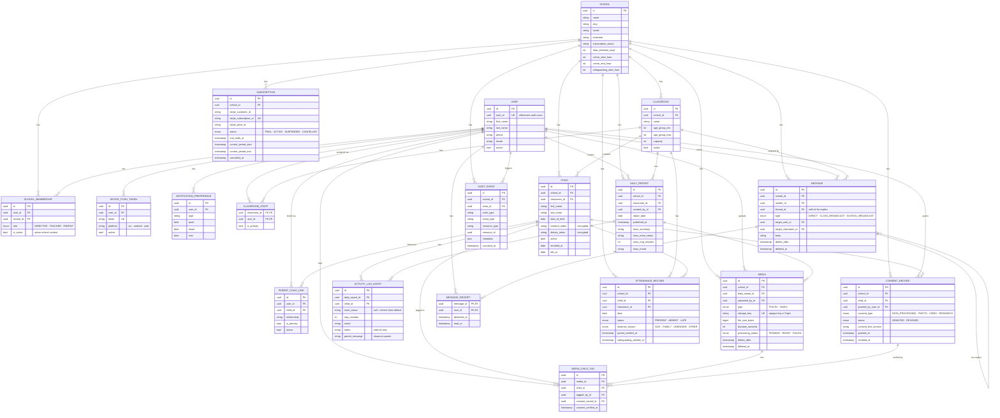

# Entity Relationship Diagram
**Last Updated**: 2026-04-14

```mermaid
erDiagram
    SCHOOL {
        uuid id PK
        string name
        string slug
        string locale
        string timezone
        string subscription_status
        int data_retention_days
        int comm_start_hour
        int comm_end_hour
        int safeguarding_alert_hour
    }

    USER {
        uuid id PK
        uuid auth_id UK "references auth.users"
        string first_name
        string last_name
        string phone
        string locale
        bool active
    }

    SCHOOL_MEMBERSHIP {
        uuid id PK
        uuid user_id FK
        uuid school_id FK
        enum role "DIRECTOR · TEACHER · PARENT"
        bool is_active "active school context"
    }

    SUBSCRIPTION {
        uuid id PK
        uuid school_id FK
        string stripe_customer_id
        string stripe_subscription_id UK
        string stripe_price_id
        enum status "TRIAL · ACTIVE · SUSPENDED · CANCELLED"
        timestamp trial_ends_at
        timestamp current_period_start
        timestamp current_period_end
        timestamp cancelled_at
    }

    DEVICE_PUSH_TOKEN {
        uuid id PK
        uuid user_id FK
        string token UK
        string platform "ios · android · web"
        bool active
    }

    NOTIFICATION_PREFERENCE {
        uuid id PK
        uuid user_id FK
        string type
        bool push
        bool email
        bool sms
    }

    CLASSROOM {
        uuid id PK
        uuid school_id FK
        string name
        int age_group_min
        int age_group_max
        int capacity
        bool active
    }

    CLASSROOM_STAFF {
        uuid classroom_id PK,FK
        uuid user_id PK,FK
        bool is_primary
    }

    CHILD {
        uuid id PK
        uuid school_id FK
        uuid classroom_id FK
        string first_name
        string last_name
        date date_of_birth
        string medical_notes "encrypted"
        string dietary_notes "encrypted"
        bool active
        date enrolled_at
        date left_at
    }

    PARENT_CHILD_LINK {
        uuid id PK
        uuid user_id FK
        uuid child_id FK
        string relationship
        bool is_primary
        bool active
    }

    CONSENT_RECORD {
        uuid id PK
        uuid school_id FK
        uuid child_id FK
        uuid granted_by_user_id FK
        enum consent_type "DATA_PROCESSING · PHOTO · VIDEO · RESEARCH"
        enum status "GRANTED · REVOKED"
        string consent_text_version
        timestamp granted_at
        timestamp revoked_at
    }

    DAILY_REPORT {
        uuid id PK
        uuid school_id FK
        uuid classroom_id FK
        uuid created_by_id FK
        date report_date
        timestamp published_at
        string class_summary
        string class_meal_status
        int class_nap_minutes
        string class_mood
    }

    ACTIVITY_LOG_ENTRY {
        uuid id PK
        uuid daily_report_id FK
        uuid child_id FK
        string meal_status "null = inherit class default"
        int nap_minutes
        string mood
        string notes "internal only"
        string parent_message "shown to parent"
    }

    MEDIA {
        uuid id PK
        uuid school_id FK
        uuid daily_report_id FK
        uuid uploaded_by_id FK
        enum type "PHOTO · VIDEO"
        string storage_key UK "opaque key in Tigris"
        bigint file_size_bytes
        int duration_seconds
        enum processing_status "PENDING · READY · FAILED"
        timestamp delete_after
        timestamp deleted_at
    }

    MEDIA_CHILD_TAG {
        uuid id PK
        uuid media_id FK
        uuid child_id FK
        uuid tagged_by_id FK
        uuid consent_record_id FK
        timestamp consent_verified_at
    }

    MESSAGE {
        uuid id PK
        uuid school_id FK
        uuid sender_id FK
        uuid thread_id FK "self-ref for replies"
        enum type "DIRECT · CLASS_BROADCAST · SCHOOL_BROADCAST"
        uuid target_user_id FK
        uuid target_classroom_id FK
        string body
        timestamp delete_after
        timestamp deleted_at
    }

    MESSAGE_RECEIPT {
        uuid message_id PK,FK
        uuid user_id PK,FK
        timestamp delivered_at
        timestamp read_at
    }

    ATTENDANCE_RECORD {
        uuid id PK
        uuid school_id FK
        uuid child_id FK
        uuid classroom_id FK
        date date
        enum status "PRESENT · ABSENT · LATE"
        enum absence_reason "SICK · FAMILY · UNKNOWN · OTHER"
        timestamp parent_notified_at
        timestamp safeguarding_alerted_at
    }

    AUDIT_EVENT {
        uuid id PK
        uuid school_id FK
        uuid actor_id FK
        string actor_type
        string event_type
        string resource_type
        uuid resource_id
        json metadata
        timestamp occurred_at
    }

    %% ── Relationships ──────────────────────────────────────────────

    SCHOOL ||--o{ SCHOOL_MEMBERSHIP : "has"
    USER   ||--o{ SCHOOL_MEMBERSHIP : "belongs to schools via"
    SCHOOL ||--o{ SUBSCRIPTION : "has"
    SCHOOL ||--o{ CLASSROOM : "has"
    SCHOOL ||--o{ CHILD : "has"
    SCHOOL ||--o{ DAILY_REPORT : "has"
    SCHOOL ||--o{ MEDIA : "has"
    SCHOOL ||--o{ MESSAGE : "has"
    SCHOOL ||--o{ ATTENDANCE_RECORD : "has"
    SCHOOL ||--o{ CONSENT_RECORD : "has"
    SCHOOL ||--o{ AUDIT_EVENT : "has"

    USER ||--o{ DEVICE_PUSH_TOKEN : "has"
    USER ||--o{ NOTIFICATION_PREFERENCE : "has"
    USER ||--o{ CLASSROOM_STAFF : "assigned via"
    USER ||--o{ PARENT_CHILD_LINK : "linked via"
    USER ||--o{ MESSAGE : "sends"
    USER ||--o{ MESSAGE_RECEIPT : "has"
    USER ||--o{ MEDIA : "uploads"
    USER ||--o{ MEDIA_CHILD_TAG : "tags"
    USER ||--o{ DAILY_REPORT : "creates"
    USER ||--o{ CONSENT_RECORD : "grants"
    USER ||--o{ AUDIT_EVENT : "triggers"

    CLASSROOM ||--o{ CLASSROOM_STAFF : "has"
    CLASSROOM ||--o{ CHILD : "contains"
    CLASSROOM ||--o{ DAILY_REPORT : "has"
    CLASSROOM ||--o{ ATTENDANCE_RECORD : "has"
    CLASSROOM ||--o{ MESSAGE : "targeted by"

    CHILD ||--o{ PARENT_CHILD_LINK : "linked via"
    CHILD ||--o{ CONSENT_RECORD : "has"
    CHILD ||--o{ ATTENDANCE_RECORD : "has"
    CHILD ||--o{ ACTIVITY_LOG_ENTRY : "has"
    CHILD ||--o{ MEDIA_CHILD_TAG : "tagged in"

    DAILY_REPORT ||--o{ ACTIVITY_LOG_ENTRY : "has"
    DAILY_REPORT ||--o{ MEDIA : "has"

    MEDIA ||--o{ MEDIA_CHILD_TAG : "has"

    CONSENT_RECORD ||--o{ MEDIA_CHILD_TAG : "verified by"

    MESSAGE ||--o{ MESSAGE_RECEIPT : "has"
    MESSAGE ||--o{ MESSAGE : "has replies"
```
